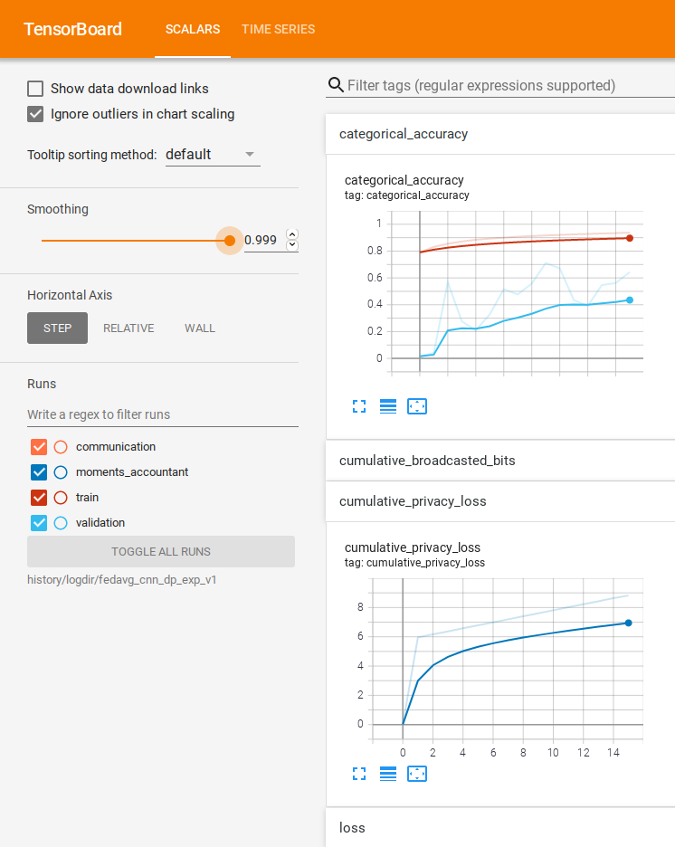
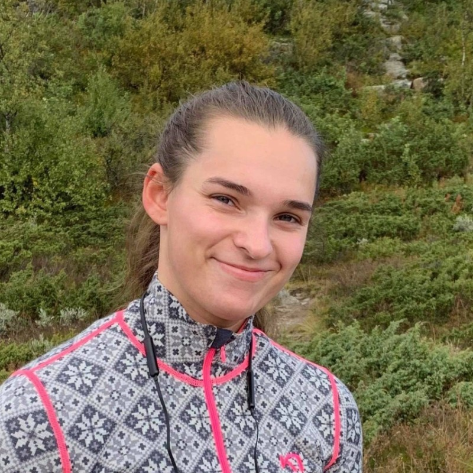

[](https://creativecommons.org/licenses/by/4.0/)

__federated__ is the source code for the Bachelor's Thesis
<center><i>Privacy-Preserving Federated Learning Applied to Decentralized Data</i></center>
<br>

Federated learning (also known as collaborative learning) is a machine learning technique that trains an algorithm across multiple decentralized edge devices or servers holding local data samples, without exchanging them. In this project, the decentralized data is the [MIT-BIH Arrhythmia Database](https://www.physionet.org/content/mitdb/1.0.0/).

## Features
* ML pipelines using centralized learning or federated learning.
* Support for the following aggregation methods:
  * Federated Stochastic Gradient Descent (FedSGD)
  * Federated Averaging (FedAvg)
  * Differentially-Private Federated Averaging (DP-FedAvg)
  * Federated Averaging with Homomorphic Encryption
  * Robust Federated Aggregation (RFA)
* Support for the following models:
  * A simple softmax regressor
  * A feed-forward neural network (ANN)
  * A convolutional neural network (CNN)
* Model compression in federated learning.

## Installation
### Prerequisites
* Python 3.8
* Docker 20.10 (optional)

### Installing federated locally

__1. Cloning federated__

```bash
$ git clone https://gitlab.stud.idi.ntnu.no/dilawarm/federated.git
$ cd federated
```

__2. Install the Python development environment__

<u>On Ubuntu:</u>
```bash
$ sudo apt update
$ sudo apt install python3-dev 
$ python3-pip  # Python 3
$ sudo pip3 install --user --upgrade virtualenv
```

<u>On macOS:</u>
```bash
$ /usr/bin/ruby -e "$(curl -fsSL https://raw.githubusercontent.com/Homebrew/install/master/install)"
$ export PATH="/usr/local/bin:/usr/local/sbin:$PATH"
$ brew update
$ brew install python  # Python 3
$ sudo pip3 install --user --upgrade virtualenv
```

__3. Create a virtual environment__

```bash
$ virtualenv --python python3 "venv"
$ source "venv/bin/activate"
(venv) $ pip install --upgrade pip
```

__4. Install the packages from requirements.txt__

```bash
(venv) $ pip install -r requirements.txt
```

__5. Test TensorFlow Federated__

```bash
(venv) $ python -c "import tensorflow_federated as tff; print(tff.federated_computation(lambda: 'Hello World')())"
```

### Install with Docker (optional)

__1. Build image from Dockerfile__

```bash
$ docker build --tag federated:latest .
```

__2. Run the image__

```bash
$ docker run -t -i federated:latest bash
```

## Running experiments with federated
**federated** has a client program, where one can initialize the different pipelines and train models with centralized or federated learning. To run this client program:

```bash
(venv) $ python -m federated.main --help
```
This will display a list of options. 

```bash
usage: main.py [-h] -l  -n  [-e] [-op] [-b] [-o] -m  [-lr]

Experimentation pipeline for federated 🚀

optional arguments:
  -b , --batch_size     The batch size. (default: 32)
  -e , --epochs         Number of global epochs. (default: 15)
  -h, --help            show this help message and exit
  -l , --learning_approach 
                        Learning apporach (centralized, federated). (default: None)
  -lr , --learning_rate 
                        Learning rate for server optimizer. (default: 1.0)
  -m , --model          The model to be trained with the learning approach (ann, softmax_regression, cnn). (default: None)
  -n , --experiment_name 
                        The name of the experiment. (default: None)
  -o , --output         Path to the output folder where the experiment is going to be saved. (default: history)
  -op , --optimizer     Server optimizer (adam, sgd). (default: sgd)
```

Here is an example on how to train a cnn model with federated learning for 10 global epochs using the SGD server-optimizer with a learning rate of 0.01:

```bash
(venv) $ python -m federated.main --learning_approach federated --model cnn --epochs 10 --optimizer sgd --learning_rate 0.01 --experiment_name experiment_name --output path/to/experiments
```

Running the command illustrated above, will display a list of input fields where one can fill in more information about the training configuration, such as aggregation method, if differential privacy should be used etc. Once all training configurations have been decided, the pipeline will be initialized. All logs and training configurations will be stored in the folder *path/to/experiments/logdir/experiment_name.* 

## Analyzing experiments with federated
### TensorBoard

To analyze the results with TensorBoard, write:

```bash
(venv) $ tensorboard --logdir=path/to/experiments/logdir/experiment_name --port=6060
```



### Jupyter Notebook

To analyze the results in the ModelAnalysis notebook, open the notebook with your editor. For example:

```bash
(venv) $ code notebooks/ModelAnalysis.ipynb
```

Replace the first line in this notebook with the absolute path to your experiment folder, and run the notebook to see the results.

## Documentation

The documentation can be found [here](https://federated-docs.firebaseapp.com/). 

To generate the documentation locally, write:

```bash
(venv) $ cd docs
(venv) $ make html
(venv) $ firefox _build/html/index.html
```

## Tests

The unit tests included in **federated** are:
* Tests for data preprocessing
* Tests for different machine learning models
* Tests for the training loops 
* Tests for the different privacy algorithms such as RFA. 

To run all the tests, write:

```bash
(venv) $ make test
```

To generate coverage after running the tests, write:

```bash
(venv) $ coverage html
(venv) $ firefox htmlcov/index.html
```

See the [Makefile](Makefile) for more commands to run the modules in **federated** separately.

## How to Contribute

1. Clone repo and create a new branch: `$ git checkout https://gitlab.stud.idi.ntnu.no/dilawarm/federated.git -b name_for_new_branch`.
2. Make changes and test.
3. Submit Pull Request with comprehensive description of changes.

## Authors



**Pernille Kopperud**


**Dilawar Mahmood**

Enjoy! :slightly_smiling_face: